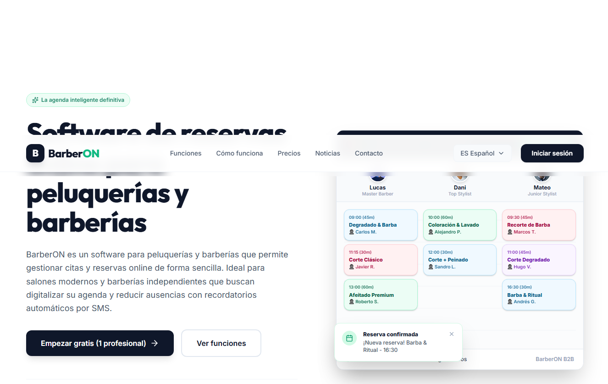
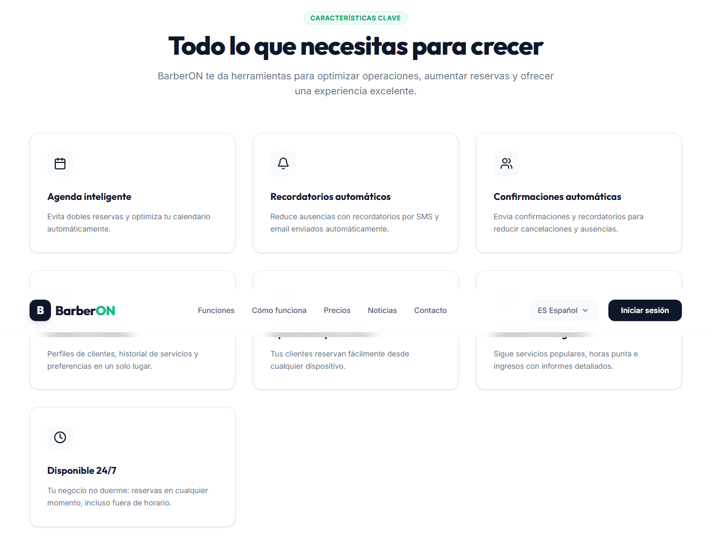
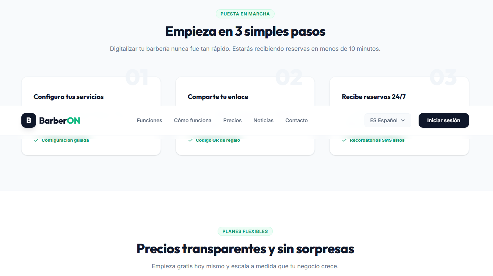

# BarberON

Software de reservas online diseñado para digitalizar y optimizar la agenda de barberías y peluquerías.

## Resumen del Proyecto

BarberON es una solución B2B (Business-to-Business) orientada a la gestión de citas y organización interna de salones de estética y cuidado personal. Proporciona una interfaz moderna e intuitiva tanto para los clientes finales que desean reservar servicios como para los profesionales que gestionan su día a día.

El sistema fue concebido bajo el principio de simplicidad operativa, permitiendo que cualquier establecimiento escale su organización sin requerir conocimientos técnicos avanzados. 

## Problemas que Resuelve

El sector del cuidado personal sufre constantes pérdidas de ingresos debido a problemas de logística en su agenda diaria. BarberON aborda directamente los siguientes inconvenientes operativos:

1. **Gestión Ineficiente del Tiempo:** Reemplaza los apuntes manuales y las interminables consultas por mensajes directos (como WhatsApp) que interrumpen el trabajo de los profesionales.
2. **Reducción de Ausencias:** Evita los "no-shows" (clientes que olvidan su turno) mediante la automatización de confirmaciones y recordatorios por diversos canales.
3. **Disponibilidad Restringida:** Habilita la recepción de citas las 24 horas del día, los 7 días de la semana, captando reservas incluso fuera del horario comercial del local.
4. **Desorganización de Personal:** Consolida la agenda de múltiples profesionales en una única vista centralizada, evitando dobles reservas y superposiciones.

## Tecnologías Utilizadas

- **React 19:** Biblioteca principal para la construcción de interfaces de usuario.
- **TypeScript:** Tipado estático para garantizar la integridad y calidad del código.
- **Tailwind CSS v4:** Framework de utilidades para el diseño rápido, moderno y completamente adaptable.
- **Vite:** Herramienta de compilación optimizada para tiempos de carga de desarrollo ultra rápidos.
- **Lucide React:** Iconografía vectorial minimalista.

## Interfaz y Presentación Visual

A continuación se presentan capturas representativas de la interfaz de usuario:







## Instrucciones de Instalación

Para ejecutar este proyecto en un entorno local de desarrollo, siga los siguientes comandos:

```bash
# 1. Instalar las dependencias
npm install

# 2. Iniciar el servidor de desarrollo
npm run dev

# 3. Compilar para producción
npm run build
```

El servidor local se ejecutará típicamente en el puerto 5173. Abra la URL proporcionada en la terminal para visualizar y probar el software.
